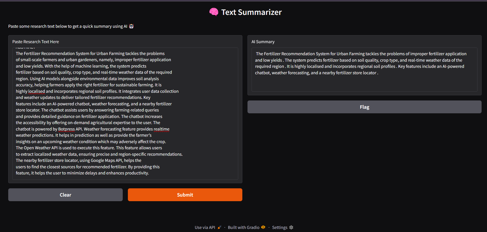

# 100-days-of-AI
## Day 1 : AI text summarizer
Welcome to my Day 1 of the #100DaysOfAI challenge!
In this mini-project, I built a simple AI-powered Text Summarizer that reads long texts (like research articles, blogs, essays) and produces concise, meaningful summaries.

### What it does?
Paste any long-form text (essay, article, research intro) and get a quick summary using AI!

 Paste any long text into the UI

 Split the text smartly into manageable chunks

 Summarize using a pre-trained transformer model

 Get a clean summary output in a simple UI

 ### Tech Stack
Transformers
NLTK
Gradio
Google Colab

### How it works?
User pastes the long text into the Gradio textbox

The app splits it into chunks (to avoid token size errors)

Each chunk is passed to the summarization model

AI generates concise summaries for each chunk

All summaries are combined and shown to the user

### Screenshot

 

